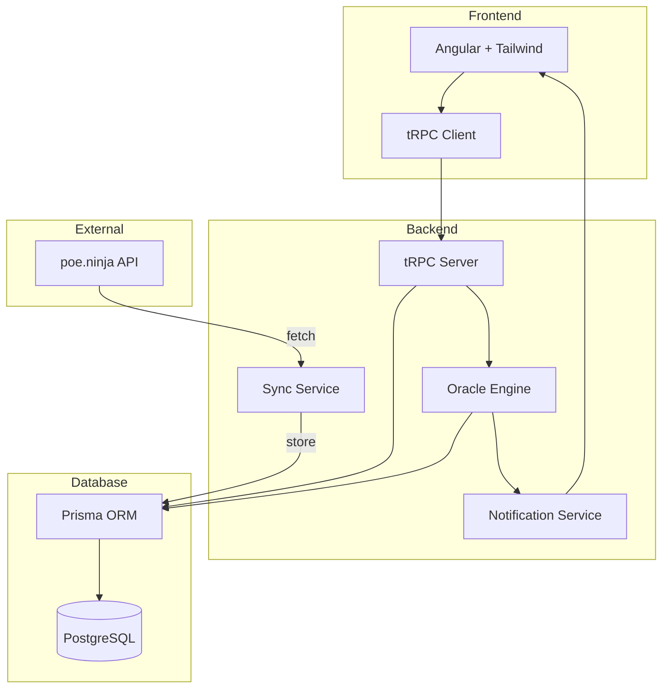

# Technical Design: POE Trade Tracking

## Architecture Overview



## Database Schema (Prisma)

### Core Models

```prisma
// Currency balances (Wallet)
model Wallet {
  id        String   @id @default(cuid())
  currency  Currency
  balance   Decimal  @db.Decimal(18, 8)
  updatedAt DateTime @updatedAt
}

enum Currency {
  DIVINE
  CHAOS
  EXALTED
}

// Items held for trading (Vault)
model VaultItem {
  id           String   @id @default(cuid())
  itemId       String   // Reference to MarketItem
  item         MarketItem @relation(fields: [itemId], references: [id])
  quantity     Int
  costBasis    Decimal  @db.Decimal(18, 8)  // Price paid per unit
  costCurrency Currency
  acquiredAt   DateTime @default(now())
  notes        String?
  updatedAt    DateTime @updatedAt
}

// Market data from poe.ninja
model MarketItem {
  id          String   @id @default(cuid())
  externalId  String   @unique  // poe.ninja item ID
  name        String
  category    String
  imageUrl    String?

  // Current prices
  divineRate  Decimal? @db.Decimal(18, 8)
  chaosRate   Decimal? @db.Decimal(18, 8)
  exaltedRate Decimal? @db.Decimal(18, 8)

  // Volume
  volume24h   Decimal? @db.Decimal(18, 2)

  // Timestamps
  lastSync    DateTime @default(now())
  createdAt   DateTime @default(now())
  updatedAt   DateTime @updatedAt

  // Relations
  priceHistory PriceHistory[]
  vaultItems   VaultItem[]
  orders       TradeOrder[]
  trades       Trade[]
}

// Historical prices
model PriceHistory {
  id        String   @id @default(cuid())
  itemId    String
  item      MarketItem @relation(fields: [itemId], references: [id])

  timestamp DateTime
  rate      Decimal  @db.Decimal(18, 8)
  currency  Currency
  volume    Decimal? @db.Decimal(18, 2)

  @@unique([itemId, timestamp, currency])
}

// Trade orders (pending buy/sell)
model TradeOrder {
  id          String      @id @default(cuid())
  itemId      String
  item        MarketItem  @relation(fields: [itemId], references: [id])

  type        OrderType
  quantity    Int
  targetPrice Decimal     @db.Decimal(18, 8)
  currency    Currency

  status      OrderStatus @default(PENDING)

  createdAt   DateTime    @default(now())
  executedAt  DateTime?
  cancelledAt DateTime?

  // When executed, links to the actual trade
  trade       Trade?
}

enum OrderType {
  BUY
  SELL
}

enum OrderStatus {
  PENDING
  EXECUTED
  CANCELLED
}

// Executed trades (history)
model Trade {
  id          String     @id @default(cuid())
  itemId      String
  item        MarketItem @relation(fields: [itemId], references: [id])

  type        OrderType
  quantity    Int
  price       Decimal    @db.Decimal(18, 8)
  currency    Currency

  // Optional link to original order
  orderId     String?    @unique
  order       TradeOrder? @relation(fields: [orderId], references: [id])

  executedAt  DateTime   @default(now())
  notes       String?
}
```

## API Design (tRPC Routers)

### Market Router

```typescript
marketRouter = router({
  // Get all items with current prices
  getItems: publicProcedure
    .input(
      z.object({
        category: z.string().optional(),
        search: z.string().optional(),
        limit: z.number().default(50),
      }),
    )
    .query(),

  // Get single item with full history
  getItem: publicProcedure.input(z.object({ id: z.string() })).query(),

  // Trigger manual sync
  syncNow: publicProcedure.mutation(),

  // Get last sync timestamp
  getSyncStatus: publicProcedure.query(),
});
```

### Wallet Router

```typescript
walletRouter = router({
  // Get all currency balances
  getBalances: publicProcedure.query(),

  // Update a currency balance
  updateBalance: publicProcedure
    .input(
      z.object({
        currency: z.enum(['DIVINE', 'CHAOS', 'EXALTED']),
        balance: z.number(),
      }),
    )
    .mutation(),

  // Get net worth in primary currency
  getNetWorth: publicProcedure.query(),
});
```

### Vault Router

```typescript
vaultRouter = router({
  // Get all vault items with current values
  getItems: publicProcedure.query(),

  // Add item to vault (purchase)
  addItem: publicProcedure
    .input(
      z.object({
        itemId: z.string(),
        quantity: z.number(),
        costBasis: z.number(),
        costCurrency: z.enum(['DIVINE', 'CHAOS', 'EXALTED']),
        notes: z.string().optional(),
      }),
    )
    .mutation(),

  // Remove item from vault (sold)
  removeItem: publicProcedure.input(z.object({ id: z.string() })).mutation(),

  // Get unrealized P&L
  getUnrealizedPnL: publicProcedure.query(),
});
```

### Orders Router

```typescript
ordersRouter = router({
  // Get all orders (with filters)
  getOrders: publicProcedure
    .input(
      z.object({
        status: z.enum(['PENDING', 'EXECUTED', 'CANCELLED']).optional(),
        type: z.enum(['BUY', 'SELL']).optional(),
      }),
    )
    .query(),

  // Create new order
  createOrder: publicProcedure
    .input(
      z.object({
        itemId: z.string(),
        type: z.enum(['BUY', 'SELL']),
        quantity: z.number(),
        targetPrice: z.number(),
        currency: z.enum(['DIVINE', 'CHAOS', 'EXALTED']),
      }),
    )
    .mutation(),

  // Execute order (manual resolution)
  executeOrder: publicProcedure
    .input(
      z.object({
        orderId: z.string(),
        actualPrice: z.number().optional(), // If different from target
      }),
    )
    .mutation(),

  // Cancel order
  cancelOrder: publicProcedure.input(z.object({ id: z.string() })).mutation(),
});
```

### Oracle Router

```typescript
oracleRouter = router({
  // Get trade suggestions
  getSuggestions: publicProcedure
    .input(
      z.object({
        strategy: z.enum(['ALL', 'DIP_HUNTER', 'SNIPER', 'ARBITRAGE', 'MOMENTUM']),
        limit: z.number().default(10),
      }),
    )
    .query(),

  // Get market metrics for an item
  getMetrics: publicProcedure.input(z.object({ itemId: z.string() })).query(), // Returns RSI, SMA, volatility, etc.
});
```

## Oracle Engine Algorithm

### Market Metrics Calculation

```typescript
interface MarketMetrics {
  rsi: number; // 0-100, <30 oversold, >70 overbought
  sma7: number; // 7-day simple moving average
  sma21: number; // 21-day simple moving average
  volatility: number; // Standard deviation of price changes
  momentum: number; // Rate of price change
  volumeChange: number; // Volume vs 7-day average
}

// RSI Calculation (14-period standard)
function calculateRSI(prices: number[]): number {
  // ... implementation
}

// Suggestion Scoring
function scoreTrade(item: MarketItem, metrics: MarketMetrics): TradeScore {
  let score = 0;

  // Dip Hunter: Low RSI + Below SMA
  if (metrics.rsi < 30 && item.currentPrice < metrics.sma7) {
    score += 30;
  }

  // Momentum: High RSI + Above SMA + Volume spike
  if (metrics.rsi > 50 && item.currentPrice > metrics.sma21 && metrics.volumeChange > 1.5) {
    score += 25;
  }

  // Volatility opportunity
  if (metrics.volatility > 0.1) {
    score += 20;
  }

  // Volume confidence
  if (item.volume24h > 1000) {
    score += 15;
  }

  return { item, score, reason: determineReason(metrics) };
}
```

## UI Components (Tailwind)

### Key Pages

1. **Dashboard** (`/`) - Overview of portfolio, active orders, top opportunities
2. **Market** (`/market`) - Browse all items with search/filter
3. **Wallet** (`/wallet`) - Manage currency balances
4. **Vault** (`/vault`) - Manage trading inventory
5. **Orders** (`/orders`) - Active and historical orders
6. **Oracle** (`/oracle`) - Trade suggestions

### Design Tokens (Tailwind Config)

```javascript
// tailwind.config.js
{
  theme: {
    extend: {
      colors: {
        primary: { /* poe-inspired gold */ },
        profit: { DEFAULT: '#10b981' },    // Green for gains
        loss: { DEFAULT: '#ef4444' },      // Red for losses
        neutral: { DEFAULT: '#6b7280' },
      }
    }
  }
}
```

## Notification System

### Browser Notifications

- Permission request on first visit
- Trigger on: order target reached, high-value opportunity

### In-App Toasts

- Real-time updates via Server-Sent Events or polling
- Stack management for multiple notifications

## Docker Setup

```yaml
# docker-compose.yml
version: '3.8'
services:
  db:
    image: postgres:16
    environment:
      POSTGRES_USER: divine
      POSTGRES_PASSWORD: power
      POSTGRES_DB: divine_power
    ports:
      - '5432:5432'
    volumes:
      - pgdata:/var/lib/postgresql/data

volumes:
  pgdata:
```

## Testing Strategy

### Unit Tests (Vitest)

- Oracle algorithm calculations
- Price conversion utilities
- tRPC router handlers

### Integration Tests

- Database operations with test containers
- poe.ninja sync service (mocked API)

### E2E Tests (Playwright)

- Order creation flow
- Trade execution flow
- Dashboard data display
